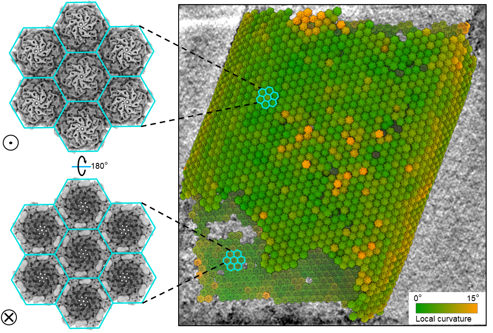

### Note: This package is actively been updated. I recommend user using Git to install this package such that you can use Git pull to easily catch up the updates. ###

## Installation and Mannual ##
Please check this user manual for usage of TomoNet: 
https://mercurial-carriage-b95.notion.site/TomoNet-Tutorial-Version-08302023-66c15fe1c9d24d50a03696700890fe10?pvs=4

## Tutorial Data and some related files ##
https://drive.google.com/drive/folders/11-C55NptELHsv0vi-ZCuFckbLx4un8a1?usp=sharing

## Contact ##
Any issues related to usage of TomoNet can be posted here or sent to email: logicvay2010@g.ucla.edu 

## Google Group ##
Google group: https://groups.google.com/g/tomonet_cryoet

## Reference ##
This software is supported by NIH grant, and the Paper is published here: http://dx.doi.org/10.1017/S2633903X24000060. Please cite our work if it helps with your data processing, thanks!

Please also cite the corresponding tools/packages if specific modules were used in your workflow:
###
**Motion Correction**: MotionCorr2
###
###
**3D Reconstruction**: Imod, PEET, or AreTomo
###
###
**CTF Est.**: CTFFIND4
###
###
**Manual Picking**: Imod
###
###
**Auto Exp.**: PEET
###
###
**Missing wedge compensation.**: IsoNet
###

## Examples of TomoNet Application ##
### 
 HIV Gag 2D lattice 
 ###

  
 

### 
 Gag Hexamer STA using 4 tomograms 
 ###

  
 

### 
 Microtubule Doulets 1D lattice 
 ###

  
 

### 
 S-layer 2D lattice 
 ###

  
 

## TomoNet Applications in Other Publications ##

### 
 <a href="https://doi.org/10.1128/jvi.00640-24"> LCMV GPC </a> 
 ###

  
 

### 
 S-layer lattice of M. hungatei 
 ###

  
 

